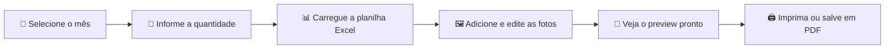

# 🎉 Aniversariantes do Mês

### *Transformando horas de trabalho manual em minutos de automação inteligente*

**🌐 [Acesse o app online](https://hslrh.lovable.app)**

---

## 💡 Por que criei este projeto?

Todo mês, em escolas, empresas e instituições, alguém precisa montar **manualmente** o famoso quadro de aniversariantes. O processo costuma ser **demorado e repetitivo**:

- 📋 Coletar nomes e datas em planilhas
- 🖼️ Recortar fotos uma por uma
- 🎨 Montar layouts no PowerPoint ou Word
- 🖨️ Ajustar cores, tamanhos e posições

**Eu vivi essa dor.** Foi por isso que criei o **Aniversariantes do Mês** — uma ferramenta que **automatiza todo o processo**, gera um quadro temático lindo em poucos cliques e devolve **horas preciosas** do seu dia.

---

## ✨ O que torna este app especial?

| Recurso | Descrição |
|---------|-----------|
| 📊 **Importação de Excel** | Carregue sua planilha `.xlsx` e veja a mágica acontecer |
| 🤖 **Remoção de Fundo com IA** | Limpe fotos automaticamente, sem precisar do Photoshop |
| 🎨 **Ajuste de Cor Manual** | Refine tons e contrastes diretamente no app |
| 🗓️ **Temas Mensais** | Cada mês ganha um plano de fundo temático único (Páscoa em abril, festa junina em junho, e por aí vai!) |
| 📐 **Grid Inteligente** | Layout muda automaticamente: **6 colunas** até 24 aniversariantes, **7 colunas** a partir de 25 |
| 🗜️ **Compressão de Imagens** | Fotos otimizadas para impressão sem perder qualidade |
| 🖨️ **Pronto para Imprimir** | Layout otimizado para folha A4 |

---

## 🚀 Como funciona?

### Passo a passo:

1. **Configure o mês** — Escolha qual mês você está montando
2. **Defina a quantidade** — Informe quantos aniversariantes terá no quadro
3. **Importe os dados** — Suba uma planilha Excel com os nomes e datas
4. **Personalize as fotos** — Adicione imagens, remova fundo com IA e ajuste cores
5. **Visualize e exporte** — Veja o resultado final e imprima em A4

---

## 🛠️ Tecnologias utilizadas

- ⚛️ **React 18** + **TypeScript** — Interface moderna e tipada
- ⚡ **Vite** — Build ultrarrápido e DX impecável
- 🎨 **Tailwind CSS** + **shadcn/ui** — Design system consistente e elegante
- 🧩 **Radix UI** — Componentes acessíveis por padrão
- ✨ **Lucide Icons** — Iconografia limpa e moderna
- 📊 **SheetJS (xlsx)** — Leitura de planilhas Excel no navegador
- ☁️ **Lovable Cloud** — Backend e Edge Functions para a IA de remoção de fundo

---

## 🎯 Para quem é este app?

- 👩‍🏫 **Professores e coordenadores** que montam murais escolares
- 🏢 **RHs e gestores de pessoas** que celebram o time todo mês
- ⛪ **Igrejas e comunidades** que homenageiam seus membros
- 🎉 **Qualquer pessoa** cansada de fazer isso manualmente!

---

## 🌟 Filosofia do projeto

> *"Tecnologia boa é aquela que devolve seu tempo."*

Este app foi construído com a missão de **eliminar trabalho repetitivo** e permitir que você foque no que realmente importa: **celebrar pessoas**.

---

**Feito com ❤️ para tornar a vida de quem celebra um pouquinho mais leve.**

⭐ Se este projeto te ajudou, deixe uma estrela no repositório!

